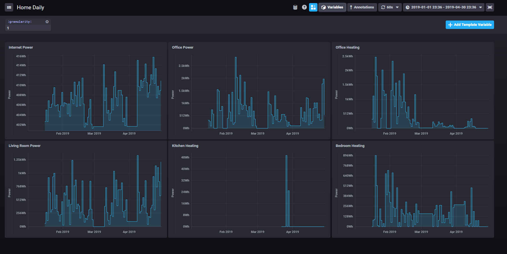

# Kasa-Tick Integration
Offers integration between TP-link smart plugs and the time series framework TICK stack.

## Dependencies ##
### Ubuntu / Raspbian ###
`apt-get install python3 python3-pip nmap
pip3 install python-nmap 'pytelegraf[http]'`

Install the TICK stack using this guide: https://www.digitalocean.com/community/tutorials/how-to-monitor-system-metrics-with-the-tick-stack-on-ubuntu-16-04

### WSL ###
`apt-get install python3 python3-pip
pip3 install python-nmap 'pytelegraf[http]'`

Install nmap for Windows because nmap in WSL does not work as expected. nmap.exe can be correctly invoked from WSL and this package will do this on WSL.
Install the TICK stack using this guide

### Configuration of Telegraf ###
Modify the telegraf configuration file:
`./telegraf --input-filter http_listener config > telegraf.conf
nano telegraf.conf
\# In the section [[inputs.http_listener]] change the first option to: service_address = "localhost:8186"
\# Comment the TLS lines (tls_allowed_cacerts, tls_cert, tls_key), HTTPS is not required because the server is listening on localhost only.`

## kasa.py ##
Demonstrates a basic API to interact with TP-Link smart plugs. These plugs can be automatically discovered on the local network and persisted across invocations of the script.

Create a home instance:
`home = Home(domain='192.168.0.0/24')`

Discover & save devices:
`home.discover()
home.save()`

Load devices:
`home.load()'`

## kasa_tick.py ##
Queries locally discovered HS110 smart plugs for the current power usage. Pushes the power and summed power over all plugs to the TICK stack platform.
The name of the metric in the TICK stack is the name of smart plug (in lower case and spaces replaced by underscores: e.g. Internet Power -> internet_power).

Example screenshot of a time series from several smart plugs

## tick ##
This folder contains some very basic scripts for running TICK stack. If you are new to TICK stack, please read its documentation as its 4 seperates components can be confusing at start.